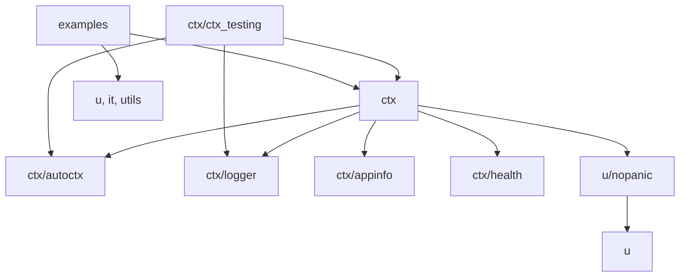
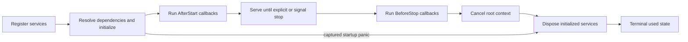

# go-ctx Architecture

This document describes the architecture implemented by the repository as of 2026-09-01.
The [project constitution](../.specify/memory/constitution.md) defines the mandatory
engineering constraints; this guide explains how those constraints map to packages and
runtime behavior.

## System Scope

`go-ctx` is an in-process Go service container. It combines:

- service registration and dependency injection;
- environment-backed configuration;
- application and service lifecycle management;
- structured logging, health aggregation, and context statistics;
- small helpers for timers, service messaging, panic capture, iteration, channels, slices,
  concurrency, and values.

It is a library rather than a network service or deployment platform. It owns no database,
transport protocol, or persistent state. Applications compose it directly and remain
responsible for domain behavior and external integrations.

The module declares Go 1.27 as its minimum supported language and toolchain baseline. A
consumer environment must provide Go 1.27 or later; raising that baseline again is a
breaking compatibility decision that requires synchronized module, CI, and migration
guidance updates.

## Design Goals

1. Keep application assembly small and explicit through `ServicePackage`.
2. Support dependency injection without generated code while validating reflection failures.
3. Give every registered service a consistent startup and shutdown lifecycle.
4. Keep the core dependency-free outside the Go standard library.
5. Make application wiring observable through logs, health, and service descriptors.

## Package Boundaries

| Path | Responsibility | Dependency rule |
|------|----------------|-----------------|
| `ctx` | Container, reflection, configuration, lifecycle, application facade, connectors, timers, stats, and health integration | Owns orchestration and may use focused subpackages and generic helpers |
| `ctx/appinfo` | Process name, version, and build metadata | Standard library only |
| `ctx/autoctx` | Process-wide service registration | Standard library only |
| `ctx/health` | Health status value types | Standard library only |
| `ctx/logger` | `slog`-backed logging facade | Standard library only |
| `ctx/ctx_testing` | Test application assembly, environment overrides, and service substitution | May depend on public `ctx` APIs and focused subpackages |
| `u` | General resource, reflection, stack, and writer helpers | Must remain independent of `ctx` |
| `u/nopanic` | Panic-to-error capture with call stacks | May depend on `u`, not `ctx` |
| `it` (package `iter`) | Pull-style generic iterators | Must remain independent of `ctx` |
| `utils/*` | Generic channels, execution pools, slice transforms, and optional values | Must remain independent of `ctx` |
| `examples/*` | Runnable demonstrations and consumer-level validation | Use public packages only |

The intended dependency direction is:



Generic helpers do not import the container. Focused subpackages do not import their parent
package, except `ctx/ctx_testing`, which is intentionally a public consumer of `ctx`.

## Core Runtime Components

### Application facade

`CreateContextualizedApplication` and `CreateAutoContextualizedApplication` assemble and
start an application. The returned `Application` exposes `Stop` and `Join`. Convenience
entry points `Run` and `RunAuto` add an `AppTask`, execute it, and stop the application.

The package keeps a process-wide current `appContext` for `GetService` and
`GetTypedService`. The currently supported operating model is
one active application context per process. Restarting after a completed stop is supported;
multiple simultaneous contexts are not an isolation boundary.

Each returned application owns a close-once stop channel, a completion channel, and one
buffered signal subscription. `Stop` records a request immediately and is idempotent;
`Join` waits for the single shutdown coordinator to finish callbacks, cancellation,
disposal, signal unregistration, identity-safe global clearing, and completion signaling.

### Application context

`appContext` owns:

- the state machine and root `context.Context`;
- registered reflective service wrappers and their states;
- the recorded dependency graph and initialized-service set;
- health reporters and service descriptors;
- synchronized lifecycle state.

Its externally visible states are `not_initialized`, `initialization`, `initialized`,
and terminal `used`. Access to services, stats, and health is valid only while initialized.

### Reflective service wrapper

Each registered value is wrapped with its reflected type, resolved name, root context, and
field value. Registration requires a pointer to a struct. The wrapper performs field
injection, environment injection, initialization callbacks, lifecycle callbacks, disposal,
and panic conversion around supported callback paths.

## Lifecycle Model



The implemented lifecycle has these phases:

1. **Registration**: packages contribute services. Duplicate names and the reserved `CTX`
   name are rejected.
2. **Initialization**: dependencies are initialized recursively when requested. Reflection
   fields and environment fields are populated before supported `Init` callbacks run.
3. **Publication and start notification**: the initialized state and global context are
   visible before `AfterStart` runs concurrently. No callback order is guaranteed.
4. **Steady state**: one application coordinator waits for an explicit stop or a catchable
   process signal.
5. **Stop notification**: `BeforeStop` runs sequentially in stable consumer-before-dependency
   topological order. Unrelated ready services are ordered by name.
6. **Cancellation**: the root context is canceled so injected contexts become done.
7. **Disposal**: initialized services are disposed concurrently through `Disposable` and
   `DisposableE`; the service maps are then released and the context becomes `used`.

Initialization dependencies impose stop ordering, while start and disposal callbacks remain
concurrent. Services must not use incidental callback ordering as a coordination mechanism.
A service should implement only the initialization variants it intends to run:
the wrapper checks each supported interface in a fixed sequence, so multiple matching
variants can all be invoked.

Startup wiring, configuration, initialization errors, and captured panics propagate through
the internal startup path. No start or stop notification runs after a failed startup; the
root context is canceled and every successfully initialized dependency is disposed before
the existing fatal creation boundary reports failure.

Callbacks execute without a container or global lock held. `AfterStart` and `BeforeStop`
may therefore use global service lookup, state, statistics, and health. Public state remains
`initialized` throughout `BeforeStop`, then changes to `used` before cancellation/disposal.

## Dependency Injection Contract

### Service registration and names

`PackageOf` groups service instances. `WithName` and `TypedWithName` provide explicit
names; `Typed` constructs a pointer to a generic type. When no explicit name is supplied,
`DefineServiceName` resolves the name in this order:

1. `Named.Name()`;
2. the type name of exactly one anonymous interface field marked `ctx:"impl"`;
3. the concrete pointer type string.

Names must be unique. `CTX` is reserved for the application context. A reflected service
must be a pointer to a struct because the container mutates its fields and tracks the same
instance throughout the lifecycle.

`ServicePackage` preserves every ordered entry until container validation. Duplicate
explicit, derived, mixed, within-package, and cross-package names therefore fail visibly
instead of being overwritten during package construction.

### Dependency lookup

`ServiceProvider.ByName` resolves an exact service name. `ServiceProvider.ByType` and
empty automatic injection resolve the reflected type string. A missing service or a cycle
encountered during recursive initialization is a wiring failure.

Global `GetTypedService[T]` uses the same reflected type name. Ordinary absence returns the
zero value of `T` and `false`; a value registered under that name with an incompatible type
panics with a diagnostic containing the name, expected type, and actual type.

The `ctx` tag grammar currently supports:

| Form | Meaning |
|------|---------|
| `ctx:""` | Automatically inject a logger, `*slog.Logger`, `context.Context`, or service by field type |
| `ctx:"service_name"` | Automatically inject using an explicit name |
| `ctx:"inject"` or `ctx:"inject(name)"` | Inject a service by type or name |
| `ctx:"logger"` or `ctx:"logger(name)"` | Inject the facade logger or `*slog.Logger` |
| `ctx:"loggerAttr(key=value)"` | Add a structured attribute to an injected logger |
| `ctx:"context"` | Inject the application root context |
| `ctx:"impl"` | Mark an anonymous interface as the implementation identity candidate |

Multiple directives may be separated by commas, spaces, colons, or semicolons. The
implementation can set unexported fields through `unsafe`; that behavior is a compatibility
boundary and requires focused tests when reflection code changes.

## Configuration Model

`GetEnv`, `Env`, and `InjectEnv` provide typed configuration. Configuration is loaded
lazily once per process. Defaults registered with `SetEnv` must therefore be set before the
first configuration lookup.

`GetEnv(name)` checks the exact process key first, then its uppercase process form only when
the exact spelling is absent, and finally the canonical uppercase non-process property map.
A present empty process value is present and suppresses fallback. The effective precedence
from highest to lowest is:

1. process environment;
2. command arguments in `--NAME=value` form;
3. `.env_custom`;
4. `.env`;
5. defaults registered through `SetEnv`.

Arguments, property files, and defaults are canonicalized to uppercase when ingested. If
exact and uppercase process keys coexist, the exact spelling requested by the caller wins.

The `env` tag names a key and may include a default, for example
`env:"TIMEOUT=5s"`. Direct injection supports strings, booleans, integers, durations,
RFC3339 times, selected slices and sets, and maps of `*EnvValue`. Unsupported types and
invalid required values fail visibly. Tracked environment files are fixtures, not a place
for credentials.

## Observability

### Logging

`InitSlog` installs the configured `slog.Handler` for both the package facade and the
standard default logger. Text, JSON, and legacy handlers are selected by environment
configuration. Logger injection tags each logger with its service name and may add declared
attributes. Applications can replace the writer or the complete handler before startup.

### Health

Services implementing `HealthReporter` are registered with the application health
aggregator. `AppContext.Health().Aggregate()` returns the overall status and per-service
components in a fresh map. Reduction is order-independent: `UP` is healthy,
`PARTIALLY`/noncritical `DOWN` normalize to application `PARTIALLY`, and
`DOWN_CRITICAL` or an unknown status yields application `DOWN`. Health reporting is
pull-based; the container does not expose a network endpoint.

### Context statistics

`AppContext.Stats()` exposes service descriptors containing resolved names, reflected
types, lifecycle capabilities, and dependencies observed during initialization. This is a
diagnostic view of wiring, not a mutable configuration API. Every `Services()` call deep
copies the map, descriptor values, and dependency slices so consumers cannot mutate
container-owned state.

## Extension Points

- Lifecycle interfaces: initialization variants, `StartAware`, `StopAware`,
  `Disposable`, and `DisposableE`.
- Naming and lookup: `Named`, `NamedService`, `ServicePackage`, and `ServiceProvider`.
- Runtime diagnostics: `HealthReporter`, `AppContextHealth`, and `AppContextStats`.
- Assembly: explicit packages or process-wide `autoctx.S` registration.
- Testing: `ctx_testing` composes the normal application, substitutes named services, and
  scopes environment overrides around a test run.
- Convenience primitives: `TimerTask` and typed `ServiceConnector` values participate in
  normal lifecycle callbacks.

Extensions should be expressed through public interfaces and composition. New global state,
hidden registration, or container-to-helper dependencies require explicit architecture
review.

## Concurrency Ownership

The core uses locks around context state, a root cancellation context, a single shutdown
coordinator, concurrent start and disposal callbacks, signal delivery, timers, and connector
goroutines. Timer and connector runs use replaceable generations with close-once termination
and joined completion; connector sends also observe peer termination. Data channels are not
closed while concurrent senders may still use them.
Every new asynchronous path must document:

- who creates it;
- which context, channel, or method stops it;
- whether senders or receivers may block;
- how repeated stop and application restart behave;
- how errors or panics become observable.

Code that changes any of these paths must include focused tests and run
`go test -race ./...`. A callback must not assume another concurrent callback has already
run unless an explicit synchronization contract provides that guarantee.

## Verification Strategy

Tests live beside the package they cover. Core lifecycle tests should favor observable
states, injected identities, callback notifications, cleanup, and restart behavior over
private implementation details. Test assembly should use `ctx/ctx_testing` when service
substitution or scoped environment values are part of the scenario.

Required repository checks are:

```text
gofmt -w path/to/edited_file.go
go build ./...
go test ./...
go vet ./...
go test -race ./...  # required for lifecycle or concurrency changes
```

The runnable examples are consumer documentation and smoke-test important composition
patterns:

- `go run ./examples/task` for short-lived task execution;
- `go run ./examples/application` for lifecycle, injection, configuration, logging,
  health, connectors, timers, and panic handling.

## Architecture Change Checklist

Before changing the container or adding a package, answer these questions in the feature
specification and plan:

1. Does this change an exported identifier, service name, tag form, configuration source,
   failure mode, or lifecycle callback?
2. Does the dependency direction remain acyclic, and can the standard library satisfy the
   need?
3. Who owns every new goroutine, channel, ticker, signal subscription, or global value?
4. What happens during initialization failure, explicit stop, context cancellation, repeated
   stop, and restart?
5. Which regression and race tests demonstrate the behavior?
6. Which README section, architecture section, package comment, or example must change?

If the answer introduces a constitution exception, record it in the implementation plan's
Complexity Tracking section before implementation.
